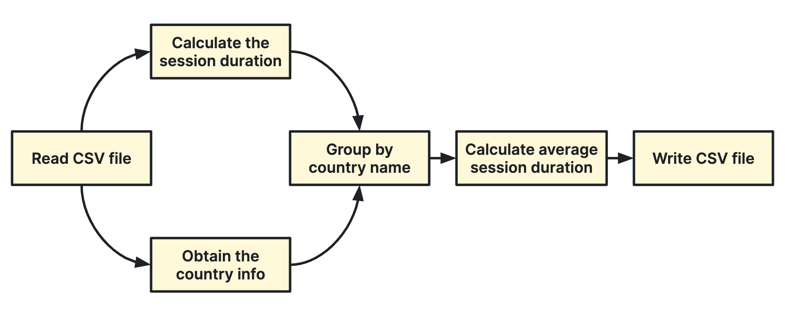

# Batch Processing with Apache Beam in Python

[](https://twitter.com/datastacktv)
[](https://www.youtube.com/channel/UCQSbqkMlvf_J949HDWxOt7Q)
[](https://datastack.tv/)

This repository holds the source code for the [Batch Processing with Apache Beam](https://datastack.tv/apache-beam-course.html) online mini-course by [@alexandraabbas](https://github.com/alexandraabbas).

In this course we use Apache Beam in Python to build the following batch data processing pipeline.



Subscribe to [datastack.tv](https://datastack.tv/pricing.html) in order to take this course. [Browse our courses here!](https://datastack.tv/courses.html)

## Set up your local environment

Before installing Apache Beam, create and activate a virtual environment. Beam Python SDK supports Python 2.7, 3.5, 3.6, and 3.7. I recommend you create a virtual environment with Python 3+.

```bash
# create a virtual environment using conda or virtualenv
conda create -n apache-beam-tutorial python=3.7

# activate your virtual environment
conda activate apache-beam-tutorial
```

Now, install Beam using pip. Install the Google Cloud extra dependency that is required for Google Cloud Dataflow runner.

```bash
pip install apache-beam[gcp]
```

## Run pipeline locally

```bash
python pipeline.py \
--input data.csv \
--output output \
--runner DirectRunner
```

## Deploy pipeline to Google Cloud Dataflow

### Set up your Google Cloud environment

Follow these step to set up all necessary resources in [Google Cloud Console](https://console.cloud.google.com/).

1. Create a Google Cloud project
2. Enable Dataflow API (in APIs & Services)
3. Create a Storage bucket in `us-central1` region

Take note of the project ID and the bucket name and use these when configuring your pipeline below.

### Run pipeline with Google Cloud Dataflow

```bash
python pipeline.py \
--input gs://<BUCKET>/data.csv \
--output gs://<BUCKET>/output \
--runner DataflowRunner \
--project <PROJECT> \
--staging_location gs://<BUCKET>/staging \
--temp_location gs://<BUCKET>/temp \
--region us-central1 \
--save_main_session
```

Now, open the [Dataflow Jobs dashboard in Google Cloud Console](https://console.cloud.google.com/dataflow/jobs) and wait for your job to finish. It will take around 5 minutes.

When finished, you should find a new file called `output-00000-of-00001.csv` in the storage bucket you've created. This is the output file that our pipeline has produced.

### Clean up Google Cloud

I recommend you delete the Google Cloud project you've created. When deleting a project all resources in that project are deleted as well.
